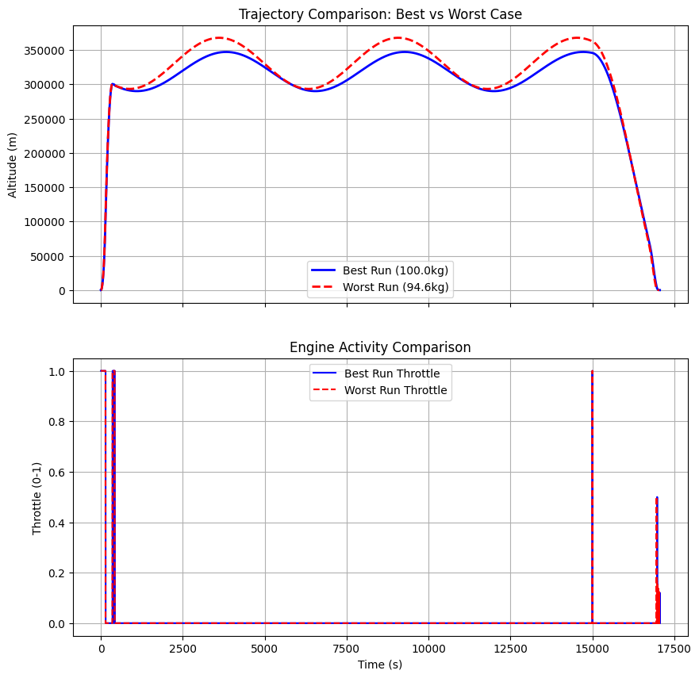

# Monte-Carlo-Rocket-Sim
Python-based vertical landing simulation for a reusable rocket, featuring PID control and Monte Carlo robustness analysis.
## Simulation Results
Here is the comparison between the most efficient landing (Green) and the least efficient survivor (Red) from 100 Monte Carlo runs.

### Efficiency Distribution

